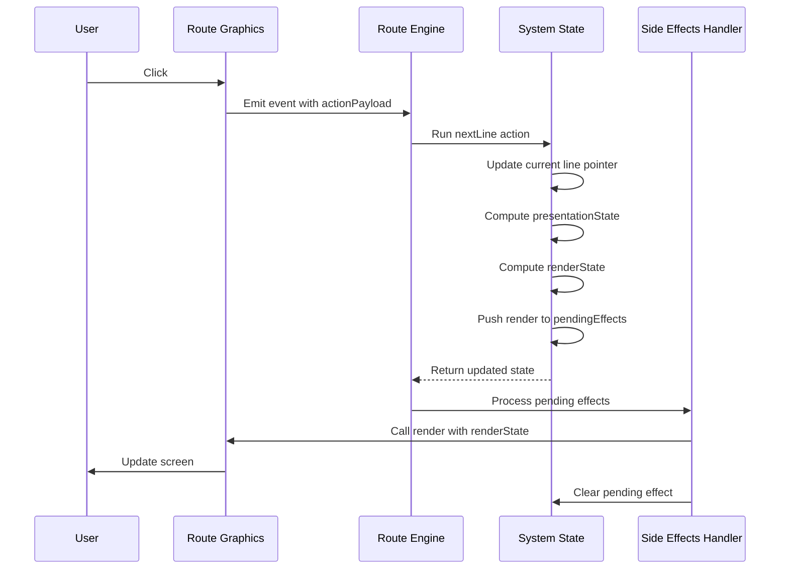

# Building a Visual Novel Engine Part 2 - Route Engine

This series will explain the whole architecture and design of RouteVN Creator. By the end of the series, you should have a good understanding of how RouteVN Creator works, and essentially how to build a Visual Novel engine from scratch.

This is part 2 of a 3 part series:

- Part 1 - Route Graphics: a declarative graphics and sound library
- Part 2 - Route Engine: a Visual Novel engine built on Route Graphics
- Part 3 - RouteVN Creator: a Desktop application to create Visual Novels without any coding

## Route Engine

Route Engine is all about the Visual Novel domain. It takes all the capabilities of Route Graphics and turns it into a full-fledged Visual Novel engine.

There were a few goals, or rather constraints, that shaped the outcome of this library:

- All graphics and audio will be handled by Route Graphics
- All content lives in a single JSON object
- The engine runtime executes that content into a fully playable Visual Novel

In this article will:
- give a backround of what circumstances shaped this library
- explain the JSON
- explian the implemtnatino
- future plans and conclusions

## Background

Visual Novels engines have been built for decades, there have been hundreds built before. Yet only a few become big and mature enough to have a significant userbase. Most development stall within 1 or 2 years. This got me thinking a lot.

Building a Visual Novel engine is deceptively simple, but it is hard in reality.

On the surface, it seems like just putting images and text on screen at specific coordinates. That's easy, and it's something that can be built quickly. This is why there are more than a dozen new VN engines every year. You need to create a wrappers around a graphics layer, and add Visual Novel specific logic.

On the other hand, building a Visual Novel engine is basically building an entire game engine. That's huge and hard. You have to manage game state, record progression for save/load/rollback, interactive UI, and asset loading, manage variables. A Visual Novel's graphics are simpler than other games, but you still have to implement everything. You can also think of it as a mini operating system.

If you're building a custom runtime for just one VN, it's relatively straightforward. You can hardcode everything. A Visual Novel engine, however, has two sets of users: the end consumer who reads the Visual Novel, and the artists and developers who use the engine to create content. The second group is much harder. You can't control what they want to make, and many issues are about usability rather than technical capability.

When you have to do both, handle complexity and serve creators, it becomes a non-trivial engineering project. One that takes many iterations and intentional design and planning.

We try optimize for three things:

- Easy to use
- Able to scale to complex features
- Reliable performance and stability

An engine that grows in features but gets pulled down by bugs is something I wanted to prevent from the original design.

Route Engine has gone through many iterations and rewrites. Probably four or five. I've lost count.

## Content vs. Runtime

The content is what the user creates. It's a JSON object. We like to write it in YAML when doing it by hand, but is is the same thing.

The runtime is the engine code. It's JavaScript, and the user cannot change it. This is where we need to implement all the functionality that is being exposed to the JSON object.

This is a fundamental design decision that shapes the engine. Users do not write actual Python or JavaScript code. We also don't expect users to write the JSON by hand. It's designed to be generated by another program.

The reason for this is our primary use case: Route Engine has been built to be used by RouteVN Creator. Our objective is to hide complexity and technicalities, exposing a simple, non-technical UI for users.

Having said that, it's very possible to build a scripting language on top of Route Engine. The engine implements all the features. A higher-level scripting language could wrap it to make it easier to use.

## Can an Entire Visual Novel Be Just a JSON File?

Possible? Yes, for sure. The problem is more about making it practical.

By practical, I mean mostly:
- Easy to use
- Achievable with limited time and resources

We're not talking about just graphics and UI like Route Graphics. We're talking about a JSON structure that represents everything including:

- Splash screens
- Menu pages with buttons
- Button click handling
- Fully customizable UI
- Dialogs and confirm boxes
- Auto mode, skip mode
- NVL mode, history mode
- Managing all variables
- Scene transitions and animations
- Everything you see in Visual Novels
- Variables and conditionals

What's not included:
- Mini games
- Customizations beyond basic Visual Novel features

All of this, without writing a single line of code. Is it practical?

We've been trying to do this for almost 2 years. The answer is mostly yes, but it's by no means easy, and we're far from done.

The key is that this isn't implemented in the JSON data structure itself. All these capabilities are implemented in JavaScript and exposed through the JSON interface.

Next, we'll go through this JSON structure and show how we represent a full Visual Novel with a single file.

### Resources

We predefine all resources upfront.

Images can be used for backgrounds, CGs, and UI. These are the building blocks of the Visual Novel. We define everything with its respective properties, each with an ID for identification.

```yaml
resources:
  layouts:
    base1:
      elements:
        - id: clickArea
          type: rect
          fill: "#000000"
          width: 1920
          height: 1080
          click:
            actionPayload:
              actions:
                nextLine: {}

    storyScreenLayout:
      elements:
        - id: dialogue-container
          type: container
          x: 50
          y: 300
          children:
            - id: dialogue-character-name
              type: text
              content: "${dialogue.character.name}"
              textStyle:
                fontSize: 24
                fill: "white"
            - id: dialogue-text
              type: text
              x: 20
              y: 100
              content: "${dialogue.content[0].text}"
              textStyle:
                fontSize: 24
                fill: "white"

  images:
    bg-classroom:
      fileId: classroom-bg
      width: 1920
      height: 1080

  characters:
    makkuro:
      name: Yuki

  tweens:
    fadeIn:
      name: "Fade In"
      properties:
        alpha:
          initialValue: 0
          keyframes:
            - duration: 700
              value: 1
              easing: linear
```

Resources are pretty straightforward. But there are few things to note:
- We're careful about resource types we support. Layouts use the direct Route Graphics structure, so they're the most flexible
- We don't want to add too many types to prevent bloat. Keeping it simple is intentional, we only add a resource type when it is really necessary.

### Story Hierarchy

This is a carefully designed data structure after many iterations to solve the branching and sequential content nature of Visual Novels.

We split the structure of a Visual Novel into:

- **Scene**: More like folders. They don't have much logic, but are useful for grouping sections
- **Section**: Is a chunk of content. A section has multiple lines. We can jump from section to section
- **Line**: Line reprsents a unit of content. Typically, one mouse click advances to the next line. A line is made up of multiple actions.
- **Action**: The smallest unit of change, does one thing such as update background image, or move character, all visible changes on the screen happen because of some action.

A section is composed of multiple lines. Jumps between sections can be fully invisible to the user (feeling continuous) or have significant transitions to feel like full scene changes.

During choices, when we need branching, we jump to another section.

Actions represent change. When we add a background, it stays there until an action removes or changes it.

Below is an example of such structure:

```yaml
story:
  initialSceneId: scene1
  scenes:
    scene1:
      name: "Opening Scene"
      initialSectionId: section1
      sections:
        section1:
          name: "Section 1"
          lines:
            - id: line1
              actions:
                base:
                  resourceId: base1
                background:
                  resourceId: bg-classroom
                dialogue:
                  mode: adv
                  gui:
                    resourceId: storyScreenLayout
                  content:
                    - text: "The morning sun filters through the classroom window."
                  characterId: makkuro
            - id: line2
              actions:
                dialogue:
                  content:
                    - text: "I take my seat and look around."
                  characterId: makkuro
            - id: line3
              actions:
                sectionTransition:
                  sectionId: section2
        section2:
          name: "Section 2"
          lines:
            - id: line1
              actions:
                dialogue:
                  mode: adv
                  gui:
                    resourceId: storyScreenLayout
                  content:
                    - text: "We're now in a new section."
                  characterId: makkuro
```

Note how all resource identifiers are references with the ID, this removed duplication and forces consistency.

In this particular scene, the Visual Novel starts a scene with a background a dialogue box with text content. When user clicks, it will show the next line with the updated text at line2.

When the user clicks again, the `sectionTransition` action is triggered, and wil move to section2's 1st line.

This data structure represents well the Visual Novel mechanics:
- Within a section, content flows **sequentally**, you click and expec to move to the next line
- Between section to section, content flows in a **branching** fashion, you can jump to any section.


### Rendering Dynamic Data

The above structure works well for static data, but actual Visual Novels are more dynamic.

By dynamic I mean that the UI may change depending on some conditions, such as a button should be shown only when a certaing flag is active.

Another common example of dynamic data is the save/load screen. On this screen you can click at one of the save slots and it's content will update.

Our solution of enabling dynamic content is via a library called Jempl which is a like a templating engine but for JSON.

Below are some examples:

**Variables**: Show current value

The value of this text comes from a dynamic variable

```yaml
elements:
  - type: text
    content: "${variables.textSpeed}"
```

**Conditionals**: Show skip indicator only when skip mode is active

This skip indicator will be shown only when `variables.skipMode == true`

```yaml
elements:
  - id: skip-indicator
    type: text
    content: "SKIP >>"
    $when: "variables.skipMode == true"
```

When calling the `toggleSkipMode` action, it updates the variable and the element appears/disappears.

**Loops**: Show save slots on the screen

This enables us to show repetitive content on the screen without hardcoding each one.

```yaml
elements:
  - $for item in saveDataArray:
    - id: save-slot-${item.id}
      type: container
      children:
        - id: slot-text-${item.id}
          type: text
          content: ${item.id}
```

The above covers the primitives to render dynamic content. These simple primitives can cover a lot of more complicated cases.

The power comes from the fact that we were able to do this while keeping a JSON only structure and without needing the user to switch to a different language.


### Interactive Elements with Actions

Interactive elements are the ones that you can hover, click, double click, scroll etc...

This is possible with a close integration between Route Graphics and Route Engine

- in the JSON, we specify an `actionPayload` on specific properties like `click`
- Route Graphics emits the event with the payload
- Route Engine receives the event and handles it

Below is an example of a text button click:

```yaml
elements:
  - id: counter-display
    type: text
    content: "Count: ${variables.clickCount}"
    x: 100
    y: 100
  - id: increment-button
    type: text
    content: "+"
    x: 100
    y: 150
    click:
      actionPayload:
        actions:
          updateVariable:
            id: uv1
            operations:
              - variableId: clickCount
                op: increment
```

When the button is clicked, the `clickCount` variable increments and the display updates to show the new value.


### Challenges

Above, we've demonstrated how resources, story hierarchy (scenes, sections, lines, actions), and Jempl create dynamic and interactive experiences.

But it's a big challenge. We're very constrained by JSON, and we need to be careful about the functionalities we introduce. We try to balance:

- Making it too specific and hardcoded (not flexible, can't meet all use cases)
- Making it too general (hard to use, users create repetitive work, different users build their own abstractions)

Finding a good balance that correctly represents the Visual Novel domain is a difficul. We are very careful about any new functionality in this JSON.

Any decision that we make on the structure of this JSON is carefully considered as it will have to be maintained for a long time, potentially forever.

**Backward compatibility** is another consideration. Any breaking change would require users to mostly start over their VN or migrate projects. We're willing to do this only when we find structural, worthy improvements that justify the breaking change.

That is all for the intorduction of the JSON. Next, we will talk more about how this JSON's functionality is actually implemented in the JavasSript runtime.

## Runtime

Designing and implementing the runtime happened iteratively together with the JSON data, they co-evolved.

No that we have described the full JSON object, lets talk about how it is atually implemented in the JavaScript code.

### Single State Architecture

This store comprise all core logic, around 80% of the codebase.

There is a single big JavaScript object that contains the full state of the Visul Novel runtime. It is called systems state.

The store is comprosmised of 3 things:

- state
- selectors
- actions

<!-- We use a single store comprising state, selectors, and mutations. It has 2 sub-stores for `renderState` and `presentationState` due to their complexity. -->

**State**:

<!-- - `systemState`: the state of the full system. There's ONLY ONE state for the whole VN. This state fully explains everything needed to render the current position -->
- `projectData`: the content JSON, a big object
- pointer object that records current sectionId and lineId
- history informatino about the lines and section user has viewed
- variables and their values
- info regarding whether auto mode or skip mode is currently enabled
- and much more


**Selectors**

are computed based on the raw system state, making it easier to work with.

- `presentationState`: the final state after computing actions for all lines. it tells you which background image, which characters, etc... need to be shown on the screen.
- `renderState`: computed from `presentationState` and `systemState`. This is sent directly to Route Graphics for updating the screen


All selectors are pure functions

**Actions**

anything interactive or any change to the state is done through actions.
some of the most used actions are:

- nextLine: will move to the next line. usually called during user click
- sectionTransition: jump to another section. used for branching, scene changes, or menu navigation
- updateVariable: modify variable values. used for counters, flags, tracking game state
- toggleAutoMode / toggleSkipMode: toggle auto-play or skip mode
- saveVnData / loadVnData: save or load game state
- addLayeredView / clearLastLayeredView: show or hide layered views like menus, options, or history
- prevLine: go to previous line. used for rollback/history feature 

If you are a frontend devleoper this would sound very familiar state managemetn terminology, because I come from a frontend dev background as well.


All actions are pure functions.

To emphasize again so 80% is just a single store for state managent. And everything is just simple pure functions.

This is what I meant when I said that I desigend this library to be able to handle complex functonlaties, but remain maintanble and not have too many bugs.

### Side Effects

Anything that has a dependency or causes a change in the external environment is a side effect.

All actions and selectors are pure functions. All actions do is update state. That's it.

The only other thing is handling side effects.

Inside the action, instead of calling the side effect directly, we just append a side effect to the system state itself:

```javascript
// Stop auto mode - queues timer cleanup and render effects
export const stopAutoMode = ({ state }) => {
  state.global.autoMode = false;
  state.global.pendingEffects.push({
    name: "clearAutoNextTimer",
  });
  state.global.pendingEffects.push({
    name: "render",
  });
  return state;
};
```

Then we have a sideEffectsHandler that needs the take the effect, and do the accordingl thing.
for `render` it will call Route Graphics's render function.

This can handle asyncornous side effects as well, we don't pass any callbacks, instead when the async operation is done, it will call another action.

### Full Example 1: Click to Next Line

The screen has a base with click actions for `nextLine`:



**Flow breakdown:**

1. User clicks → Route Graphics emits event
2. Event handler calls Route Engine to run `nextLine` action
3. Action calculates and updates the current line in state
4. Selectors compute `presentationState` & `renderState` from latest state
5. Action pushes `render` side effect to `pendingEffects` array
6. Side Effects Handler processes effects and calls Route Graphics render
7. Screen updates with new content
8. Pending effect is removed from queue

This keeps all actions pure without any direct side effects, just state mutations and queued effects.

### Runtime Challenges

All actions are pure functions. Anything needing side effects must use the side effect system.

When adding new features, we need to ensure they follow these restrictions. One tricky example was taking screenshots for save data. The screenshot part is asynchronous, so we had to do some tricks to make it work well with side effects.

Some state actions are complicated (20+ lines of code with various conditionals and loops). It becomes hard to see what's correct. Even unit tests become hard to verify. If the unit test passes 100%, it's still hard to grasp if the specification itself is correct.

This is currently a challenge. We might need to further optimize the state design to make it more tractable, similar to how we did with `renderState` and `presentationState`, or add abstractions to handle intricate stuff.

This creates a different way of doing things. We can't just imperatively call side effects. But the tradeoff is that a pure function state machine is so much easier to maintain and work with.

### Our testing

Internally, we use Route Engine to re-implement some existing short Visual Novels by hand. This tests how much we can do with the engine, what features we support, and what gaps remain.

The current state: it can do a lot of things, but there are still glitches here and there. I'd say we're able to get to around 80% reproduction of existing VNs.

the goal is to reach over 95 reproductio for simple Visual Novels, and then do the same for more advanced ones.

once we have been able to make such production it will be a matter of exposing these functionalities to RouteVN Creator.

## Conclusion

There's still work to do. We're adding support for all the most common Visual Novel functionality we encounter, while trying to tame the codebase so it doesn't grow too complicated, stays bug-free, and remains stable.

- see what changes for JSON
- optimize the state structure
- better support for localization


Route Engine is an intentionally designed compact library which has gone therough several iterations with the purpose of implementing all features needed in a Visual Novels.

This layer is not targeted to be used directly by end users, but we expect another abstraction that makes a good user interface, in our case RouteVN Creator.

Route Graphics is open source under the MIT License.

If you liked this article, consider giving it a star on [GitHub](https://github.com/RouteVN/route-graphics).

In the next post, we'll talk about RouteVN Creator, the actual editor, and how it's built on top of Route Engine. We've spent much more time on RouteVN Creator than any other library.


